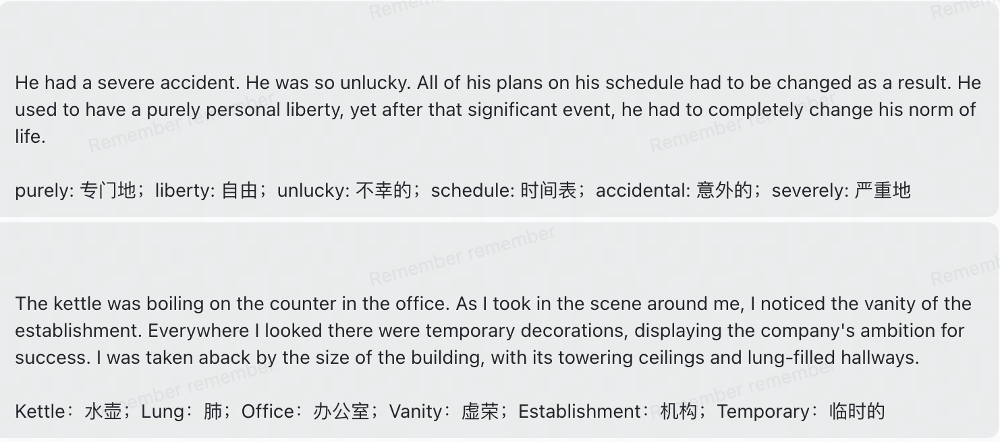
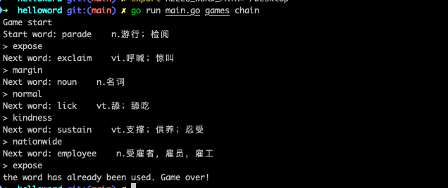

# hello word

### 背景 
Hello Word是我在背单词的过程中想到的一个想法。在学习英语时，词汇量是非常重要的。仅仅死记硬背单词，没有语境感，效率是很低的。虽然一些应用程序可以根据单词的多个词义为单词组成一小段句子，稍微增强语境感。但是单词仍然过于零散。因此，我们是否可以将每天背诵的多个单词组合成一段小短文，以便复习这一批单词呢？这就是Hello Word的初衷。当然，ChatGPT API是实现这个想法的工具。
除此之外，还配套了几个周边小游戏。


### 初始化
#### 环境变量

```shell
HELLO_WORD_PATH # 默认不配置在 ~/.helloword
```

#### 配置文件
配置文件在conf/conf.yml里。
```yaml
gptToken: "xx" #要使用短语推送功能这个是必须的！！！可以先注册openai,然后到platform.openai.com平台申请key 

collector:
  bbdc: # 不背单词cookie，配置了可以同步不背单词的生词表。
    cookie:

# --------------------- Notification Configuration ---------------------
notify: # 通知配置，目前支持telegram，dingtalk，lark可以全配，那么所有平台都会推送一遍
  #   telegram:
  #      token: xxxxxxx # Bot Token
  #      chat_id: -123456789 # Channel / Group ID
  #   dingtalk:
  #       webhook: "https://oapi.dingtalk.com/robot/send?access_token=xxxx"
  #       secret: "" # sign secret if set
  lark:
    webhook: "xx" 
```


### 单词短语推送器

指定单词数量，随机选择单词，生成一段小短文，推送到用户指定平台。

```shell
go run main.go daemon --files="CET4.txt,CET6.txt" --spec="@every 10s" --word-number=8
```
**参数说明**
这个程序有以下可选项：
- files：默认导入 CET4.txt 单词文件，你可以通过逗号同时导入多个单词文件，它们都存储在 library 文件夹下。
- spec：表示推送频率设置，默认为每小时生成一个新的短语，具体时间规则使用的是 [robif/cron](https://github.com/robfig/cron) 库，请参考该库的文档自行设置。
- word-number：表示生成一次短语使用的单词数量，默认为 5 个，最多不超过 10 个



**单词选择规则** 
- 默认:随机 (done)
- 最近最少推送(todo)


### 单词游戏

#### 单词接龙
**游戏规则**
这是一个单词接龙游戏，游戏开始时系统会随机选择一个单词。玩家需要以该单词的最后一个字母为开头输入一个新单词，接着程序又以玩家输入单词的最后一个字母为开头输出新单词。游戏会持续进行，直到有一方出现错误。在一局游戏中，每个单词只能被使用一次。

使用
```shell
go run main.go games chain --files="CET4.txt,CET6.txt"
```
**参数说明**
- files 可选，如上




**后续规划**
- 单词正确性校验，是否是合法的英语单词(todo)
- 超时控制，用户每个回合指定时间内未输出，游戏结束(todo)
- 错误机会，一局游戏可以错误次数(todo)


#### 单词拼写(todo)

#### 单词填空(todo)
